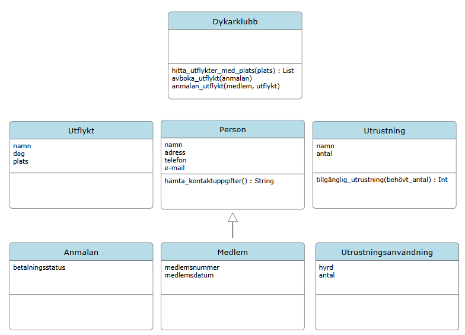

## 1️⃣ Modellering

Tänk er en dykarklubb som anordnar utfärder under sommarhalvåret. De har en webbsida där man kan läsa om klubben, men nu vill de lägga till möjlighet att anmäla sig till dykutflykterna.
- klubben behöver spara kontaktuppgifter till de som anmäler sig
- när man har betalt en avgift ska det också registreras
- man ska kunna hyra utrustning, eller ta med sig egen
- klubbens utrustning består av exempelvis våtdräkter och syrgastuber, men man har ett begränsat sortiment
- man kan avboka sig
- varje utflykt äger rum på en specifik dag och plats
- intresserade ska kunna söka efter utflykter baserat på plats
- en person måste vara ledare med huvudansvar för varje utflykt

### Uppgift
1. ge ett förslag på vilka klasser som behöver finnas
2. ta fram vilka egenskaper och metoder klasserna behöver ha
3. redogör för vilka parametrar och returvärden metoderna behöver

[Klicka på diagrammet för att öppna det i full storlek]

## 2️⃣ Kodning

## Testöversikt

### Inventory

| Metod | Testfunktion | Scenario |
|---|---|---|
| `set_item()` | `test_set_get_item()` | Lägger till ett item och kontrollerar dess antal |
| `get_amount_left()` | `test_get_amount_left()` | Hämtar antal tillgängliga items |
| `rent()` | `test_rent()` | Hyr ett item |
| `rent()` | `test_rent_no_items()` | Försöker hyra när lagret är tomt |
| `rent()` | `test_rent_multiple_same_items()` | Hyr samma item flera gånger |
| `rent()` | `test_rent_correct_item_from_multiple_items()` | Kontrollerar att rätt item påverkas |
| `rent()` | `test_rent_multiple_different_items()` | Hyr flera olika items |

### Excursion

| Metod | Testfunktion | Scenario |
|---|---|---|
| `add_member()` / `get_members()` | `test_add_get_member()` | En medlem läggs till |
| `add_member()` / `get_members()` | `test_add_get_member_many_members()` | Flera medlemmar läggs till |
| `remove_member()` | `test_remove_member()` | En medlem tas bort |
| `register_item_rented()` | `test_register_item_rented()` | Ett item registreras som uthyrt |
| `register_item_returned()` | `test_register_item_returned()` | Ett item registreras som återlämnat |
| `get_all_who_has_not_returned_items()` | `test_get_all_who_has_not_returned_items_one_member()` | En medlem har ett ej återlämnat item |
| `get_all_who_has_not_returned_items()` | `test_get_all_who_has_not_returned_items_member_many_items()` | En medlem har flera ej återlämnade items |
| `get_all_who_has_not_returned_items()` | `test_get_all_who_has_not_returned_items_member_return_one()` | En medlem lämnar tillbaka ett av flera items |
| `get_all_who_has_not_returned_items()` | `test_get_all_who_has_not_returned_items_member_return_all()` | En medlem lämnar tillbaka alla items |
| `get_all_who_has_not_returned_items()` | `test_get_all_who_has_not_returned_items_many_members()` | Flera medlemmar har ej återlämnade items |
| `get_all_who_has_not_returned_items()` | `test_get_all_who_has_not_returned_items_members_many_items()` | Flera medlemmar har flera ej återlämnade items |